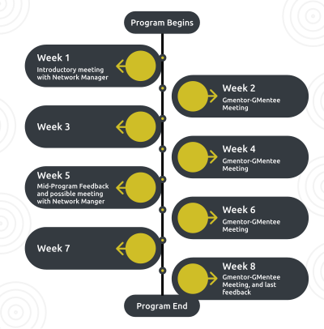

# Welcome!!

On behalf of Galaxy Project, we welcome you to **Galaxy Mentor Network**.

Whoop whoop!
## What is the Galaxy Mentor Network ?

Galaxy Mentor Network (GMN) is a community of mentors and mentees. The GMN is launching a **two-month mentoring program** designed for Galaxy community members to come together as mentors and mentees to achieve a goal, share knowledge and expertise, ask questions, receive feedback, network, and most of all, get support from peers (mentors).

This mentoring program will help members transition smoothly from one part of the community to another. It will also help members learn how to use the Galaxy tools and servers efficiently, create training material, or launch and support communities. The end goal of this project is to develop more experienced members and to speed up the growth process for new members who join the community.

The project goes to show how people-centered the Galaxy community is. **Anyone (students, engineers, researchers, etc) will have the opportunity to be mentored by topic-based experts and mentors**.
## For whom is the GMN program?

The program goes to show how people-centered the Galaxy community is. **Everyone (students,  researchers, engineers, etc) will have the opportunity to mentor and/or to be mentored by topic-based experts.**

The GMN program involves:
- **Gmentees (Galaxy Mentees)**: Galaxy members who need support and guidance from the Galaxy community members.
- **Gmentors (Galaxy Mentors)**: experienced Galaxy members who are driven by the spirit of “giving back” make their expertise and experience at Galaxy and beyond available to other Galaxy members to support them in contributing to Galaxy and transitioning from one part of the Galaxy community to another.

## How does this benefit me?

This GMN project is a **win-win for all participants**. Mentors grow in experience, gain new leadership skills and sharpen their expertise, while members can learn about open source, how to create materials, or even carry out their projects with expert supervision and guidance.

The benefits of the GMN program include:
- Mentees receive expert advice on their projects, goals, and the community.
   - Shorter learning curve through the mentorship relationship.
   - Enhancement of confidence to actively participate in the Galaxy community.
- Members are empowered to acquire important social, organizational, and technical skills.
- Mentors grow their expertise by guiding members of the community.
   - An opportunity to share experience and knowledge.
  - Learning and leadership opportunities

## How do I apply?

To apply as either a Gmentor or Gmentee, fill out this [form](https://forms.gle/nS5v8FYF7EpHwhKJ9) and also check out the [application guidelines](/application/).

## When are you launching the program?

We are also inviting you to our **official launch** of the Galaxy Mentor Network on the **3rd of March**.

The event is spanning all time zones with our worldwide community, where we will answer any questions you have regarding the GMN program. 

Join us for our exciting online launch event where we will be telling you everything you need to know about the **Galaxy Mentor Network** program and answer any questions you may have as regards the program.

### What will be the agenda?

- Introduction to the Galaxy Mentor Network by Outreachy interns (Chinonye and Rahmot).
- GMN Website Demo.
- Q & A with the audience.

### How to join? 

This will be a 24h **online event**, spanning all time zones with our worldwide community. We'll start at **08:00 Central European time**, and end at **12:00 US Eastern time**.

- **GMN Launch Call 1** - EMEA
  - <i class="fas fa-calendar"></i> When: **March 3, 08:00 Central European time**. [See your time](https://www.timeanddate.com/worldclock/fixedtime.html?msg=GMN+Launch+Call+1+-+EMEA&iso=20220303T08&p1=980&am=30).
  - <i class="fas fa-map"></i> Where: [**Zoom**](https://psu.zoom.us/j/95492229656?pwd=MUhxQU9maWtDVWRzOVpJNkoySVh2dz09)
- **GMN Launch Call 2** - Americas
  - <i class="fas fa-calendar"></i> When: **March 3, 12:00 US Eastern time**. [See your time](https://www.timeanddate.com/worldclock/fixedtime.html?msg=GMN+Launch+Call+2+-+Americas&iso=20220303T12&p1=97&am=30).
  - <i class="fas fa-map"></i> Where: [**Zoom**](https://psu.zoom.us/j/98259853922?pwd=eTNQR2ZUcjJSSmZDcXBXYzE1YjlPUT09)
- On [**Matrix**](https://matrix.to/#/#gmn-lobby:matrix.org), the **whole day** and before or after

***We look forward to seeing you there!***

## Need more information?

- <i class="fas fa-hand-point-right"></i>Visit the [GMN website](/)
- <i class="fas fa-comments"></i> Reach us on Matrix ([public channel](https://matrix.to/#/#gmn-lobby:matrix.org) or privately [Bérénice](https://matrix.to/#/@bebatut:matrix.org) or [Assunta](https://matrix.to/#/@assuntad23:matrix.org))
- <i class="fas fa-envelope"></i> Send us an email to [galaxy.mentorship@gmail.com](mailto:galaxy.mentorship@gmail.com) or reach out to either Bérénice Batut or Assunta Desanto on Matrix.
- <i class="fas fa-file-video"></i> Watch the [presentation](https://www.youtube.com/embed/w5PbI0lJGZc) from our Outreachy  interns (December 2021-March 2022 cohort) [Chinonye Mildred](https://github.com/Chinonyemildred)) and [Rahmot Afolabi ](https://github.com/rahmot)to see what to expect.

    <iframe width="560" height="315" src="https://www.youtube.com/embed/w5PbI0lJGZc" title="YouTube video player" frameborder="0" allow="accelerometer; autoplay; clipboard-write; encrypted-media; gyroscope; picture-in-picture" allowfullscreen></iframe>
    
***On behalf of the GMN team, we welcome you to our mentoring program and look forward to seeing you at the launch event.***

