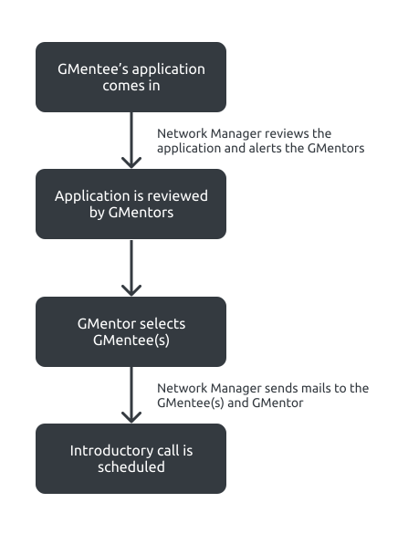
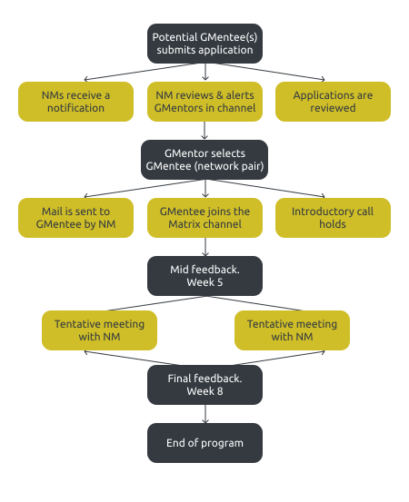

# Thank you!

We deeply appreciate you for accepting our invitation to become a Network Manager in the Galaxy Mentor Network. This page contains all the details about the GMN program to enable you to get started.

## What is GMN?

Galaxy Mentor Network (GMN) is an initiative by the community to effectively connect community members who may be new or existing members to GMentors consisting of experienced community members and topic-based experts so as to speed up the growth process of members, making them more proficient and in turn improving the growth of the Galaxy Community at large.

Our goal is to inculcate and sustain the interest of GMentors and GMentees in the mentorship program now and in the long run. We also seek to effectively match GMentees to GMentors using goals, expectations, skillset among others as indicators.

As a start, we’ll be using an open enrollment method for our mentorship program. This means that the applications will remain open and potential GMentors and GMentees can apply at any time.

## Key definitions:
- Network: This is a GMentor-GMentee(s) pair
- GMentor: GMentor means Galaxy Mentor
- GMentee: GMentee means Galaxy Mentee
- Network Manager: Members in charge of the networks, ensuring the smooth running and welfare of network pairs.

## Duties

The following gives a rundown of our expectations of Network Managers:
- Each Network Manager will be required to have a maximum of 3 networks under them per time.
- Take note of application entries
- Alert GMentors in the GMentors channel so they can review the application(s).
  - Also, remind GMentors to check the spreadsheet(where applications will be stored), this reminder can come once a month.
- Send mails to GMentees when a successful match has occurred.
- Schedule an introductory call for the new pair(Network).
- Send mid-program feedback forms to the networks in week 5 of their program.
  - When a program starts for a pair, you can record it in your calendar and set weeks 5 and 8 as events in your calendar with the feedback form links.
- Send final feedback forms to the networks in the 8th week of their program.
- Send reminders 1 week after sending the feedback forms to remind those who may not have filled the forms.
Schedule other meetings, when necessary and take be in any format (chats or calls) with the network during the course of their program to track their progress and follow up on their activities. 

## Matching Process

The hybrid system of matching will be employed in our matching process, where GMentors are also involved in the reviewing and selection process. The process looks like this:

## Tracking Progress

We intend to track progress by sending feedback forms to network pairs (GMentor and GMentee) on the 5th and 8th weeks of the program.

Also, the Network Managers will have meetings with the network pairs in their care throughout the program as decided by the NM. The first meeting comes at the beginning of the program (introductory call) and the other meetings are scheduled at the preference of the Network Manager. These meetings can come in different forms: direct meeting calls with the GMentor or GMentee or via chats.

Our goal is that even after the program, we can evaluate how the program has positively affected our participants and their day-to-day goals. Hence, we created a post mentorship program feedback.

The links to these forms are in this [Feedback](https://drive.google.com/drive/folders/1-itrgBg-kkLKwDtUzWfuS2tyL3TzljjL?usp=sharing) folder.

*P.S ignore the post-session feedback as they are automatically added to the notetaking documents for both GMentors and GMentees.*

**Find the Network Managers to do list [here](#)**

## Schematic rundown of the GMN mentoring program

